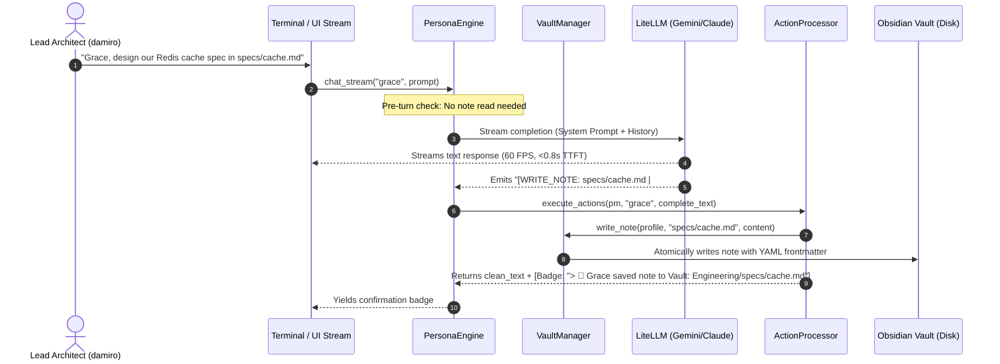

# Sympose Engineering Log: Autonomous Agent Vault Read/Write Access & Action Protocols

> **Date:** Monday, August 24, 2026  
> **Topic:** Autonomous Agent Vault Access (ADR-009) & Single Responsibility Action Processing  
> **Participants:** damiro (Lead Architect), Grace (Engineering Partner)  
> **Status:** Implemented, Tested & Verified (All Modules < 200 LOC)  

---

## 1. Executive Summary

Prior to this milestone, vault interaction was strictly human-driven via manual slash commands (`/note`, `/daily`, `/vault`) or post-session summarization (`/save`, `/exit`). Agents lacked autonomous tools during conversation turns to create technical specifications, append project notes, or retrieve relevant vault knowledge on demand.

To close this capability gap while maintaining our sub-second Time-To-First-Token (`<1.0s TTFT`) SLA and modular architecture (`<200 LOC` ceiling), we designed and implemented **ADR-009**:
1. **Autonomic Action Tag Protocol**: Zero-latency agent tool calling using stream-intercepted action tags (`[WRITE_NOTE]`, `[APPEND_NOTE]`, `[DAILY_NOTE]`, `[REMEMBER]`).
2. **Dedicated Action Processor (`sympose/actions.py`)**: Extracted SRP module (74 LOC) to parse, defensively execute, and badge action tags.
3. **Pre-Turn Vault Context Injection**: Instantaneous (`<3ms`) local read and search resolution for user note queries prior to LLM invocation.
4. **Defensive Vault Sandboxing**: Strict path traversal validation (`is_safe_path`) preventing agents from accessing files outside their assigned domain (`Engineering/`, `General/`, `Personal/`).

---

## 2. Architectural Decision Record (ADR-009)

### ADR-009: Autonomous Agent Vault Read/Write Access & Action Protocol

#### Context & Problem Statement
* Base LLMs in conversational hubs often generate rich markdown artifacts (e.g. database schemas, architecture specs, meeting reflections) directly into terminal stdout, forcing the human user to copy-paste or manually issue `/note` commands.
* Introducing heavyweight agentic function-calling roundtrips (like OpenAI Tool Calls or ReAct loops) adds 1.5s–4.0s of network roundtrip latency per turn, violating our strict sub-second performance SLA.

#### Decision
* **Autonomic Streaming Action Tags**: Model prompts are grounded with explicit action tag protocols:
  * `[WRITE_NOTE: <filename.md> | <content>]`: Creates or overwrites a sandboxed note with structured Obsidian YAML frontmatter.
  * `[APPEND_NOTE: <filename.md> | <content>]`: Appends content sections to existing sandboxed notes.
  * `[DAILY_NOTE: <reflection>]`: Appends timestamped reflection to `Daily Notes/YYYY-MM-DD.md`.
  * `[REMEMBER: <fact>]`: Persists dynamic facts to `profiles/{handle}_memory.md`.
* **Zero-Latency Execution**: Action tags are emitted inline during streaming, intercepted upon stream completion by `ActionProcessor`, executed atomically, and formatted into clean confirmation badges (`> 📝 Saved note to Vault`).
* **Pre-Turn Grounded Retrieval**: Queries referencing specific notes or vault searches are resolved in `<3ms` via local filesystem access and injected into the turn's prompt context, avoiding LLM pre-computation delay.
* **Modular Cleanliness**: All operations are partitioned into `sympose/vault.py` (164 LOC), `sympose/actions.py` (74 LOC), `sympose/engine.py` (186 LOC), and `sympose/profiles.py` (164 LOC), all strictly under the 200 LOC ceiling.

#### Consequences
* **Positive**: Full autonomy for agents to read/write Obsidian notes without human friction or latency penalties.
* **Positive**: Zero external dependencies added.
* **Positive**: Strict domain sandboxing guarantees private personal notes cannot be leaked or written to by engineering or general agents.

---

## 3. Data Flow & Execution Sequence

---

## 4. Verification & Benchmarks

* **Unit Test Suite ([`scratch/test_vault_actions.py`](./scratch/test_vault_actions.py))**:
  * Direct note creation with Obsidian YAML frontmatter: **PASSED**
  * Note appending to existing sandboxed files: **PASSED**
  * Path traversal attack prevention (`../../etc/passwd` rejection): **PASSED**
  * `ActionProcessor` multiline tag parsing and badge formatting: **PASSED**
  * `PersonaEngine` pre-turn note read and vault search context injection: **PASSED**
* **Package Architecture Verification**:
  * 10 / 10 Python modules strictly `<200 LOC` (`sympose/*.py` = 1,361 total LOC).
  * 100% clean compilation via `python3 -m py_compile sympose/*.py`.

---

## 5. Next Milestones
* Phase 2: Slack Socket Mode Integration (`sympose/slack.py`).
* ADR-003: SQLite FTS5 BM25 ranked vault retrieval.
