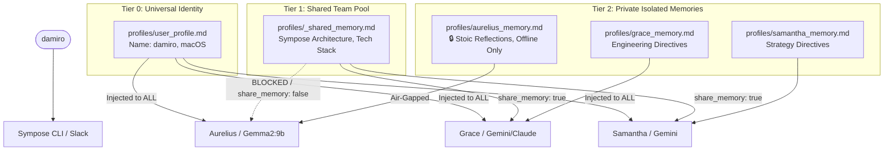

# Sympose Engineering Log: Selective Memory Sharing & Universal User Profile

> **Date:** Monday, August 24, 2026  
> **Topic:** ADR-010 Selective Memory Sharing & Universal User Profile Architecture  
> **Participants:** damiro (Lead Architect), Grace (Engineering Partner)  
> **Status:** Implemented, Tested & Verified (All Modules < 200 LOC)  

---

## 1. Executive Summary

During live testing with `@aurelius` (local Ollama), an amnesia issue surfaced: Aurelius did not know the user's name (`damiro`), while cloud personas (`@samantha` and `@grace`) did. Furthermore, user requirements dictated that while `@grace` and `@samantha` should collaborate and share project knowledge, `@aurelius` operates as a private, offline confidant whose personal journaling and sensitive memories must never leak to cloud LLMs.

To solve both challenges without token bloat or privacy compromise, we designed and implemented **ADR-010: Selective Memory Sharing & Universal User Profile Architecture**:
1. **Universal User Card (`profiles/user_profile.md`)**: A lightweight identity profile loaded automatically by **all** agents, guaranteeing universal user awareness (name, OS, core workflow style) from Turn 1.
2. **Configurable Memory Sharing (`share_memory: true | false`)**:
   - `share_memory: true` ([`samantha.yaml`](../../../profiles/samantha.yaml) & [`grace.yaml`](../../../profiles/grace.yaml)): Injects and syncs with `profiles/_shared_memory.md` for multi-agent project collaboration.
   - `share_memory: false` ([`aurelius.yaml`](../../../profiles/aurelius.yaml)): Keeps memory strictly air-gapped within `profiles/aurelius_memory.md`, with zero cross-talk to cloud shared files.

---

## 2. Architectural Decision Record

- **[ADR-010 — Selective Memory Sharing & Universal User Profile Architecture](./2026-08-24_adr-010-selective-memory-sharing-universal-user-profile.md):**
  dual-tier memory composition — Tier 0 universal `user_profile.md` for every
  agent, Tier 1 `_shared_memory.md` only when `share_memory: true`, Tier 2
  per-persona private memory — rejecting both fully-isolated memory (amnesia) and
  fully-global memory (privacy leak to cloud APIs).

---

## 3. Memory Layout & Sharing Topology

---

## 4. Verification & Benchmarks

* **Automated Test Suite ([`scratch/test_selective_memory.py`](../../../scratch/test_selective_memory.py))**:
  * Universal User Profile awareness across all personas: **PASSED**
  * Shared Team Memory injection for Samantha & Grace: **PASSED**
  * Privacy Air-Gap validation for Aurelius (0 leaks to `_shared_memory.md`): **PASSED**
  * Selective memory append routing: **PASSED**
  * ActionProcessor badge formatting: **PASSED**
* **LOC Compliance**:
  * All 10 modules in `sympose/` strictly under 200 lines (1,388 total LOC).
