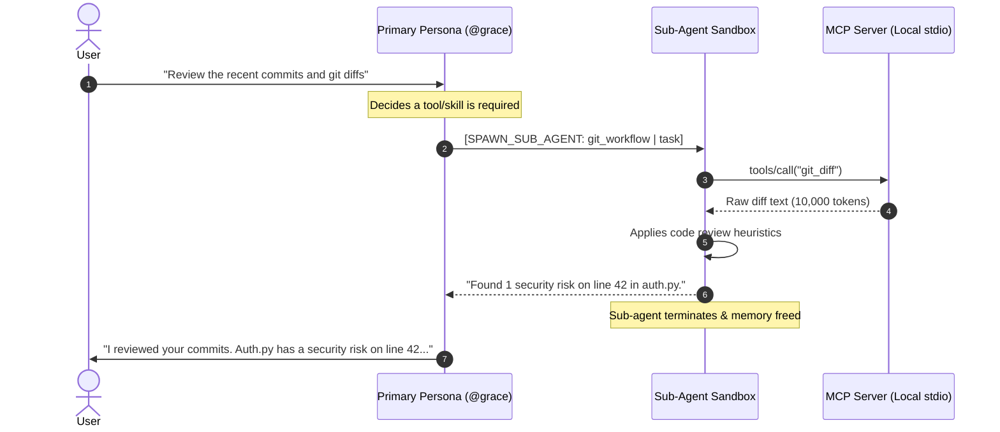

# 🔌 Model Context Protocol (MCP) & Sub-Agents

Sympose implements the **Supervisor-Worker (Orchestrator-Subagent) pattern** combined with Anthropic's **Model Context Protocol (MCP)** standard.

---

## 1. Why Sub-Agents?

In traditional agent systems, loading tools (e.g. GitHub, SQL databases, filesystems) directly into the primary persona causes two critical problems:
1. **Context Pollution**: Large raw tool outputs (e.g. 500 lines of git diffs or SQL tables) permanently bloat the chat history, degrading reasoning and inflating token costs on every subsequent message.
2. **Schema Overhead**: Declaring 50 tool schemas adds 5,000+ tokens to every single turn—even when just saying "hello".

### The Sympose Solution:
* **Primary Personas** (e.g. `@grace`, `@samantha`, `@aurelius`) remain 100% conversational, fast, and token-efficient.
* When a tool or heavy task is required, the primary persona spawns an **Ephemeral Sub-Agent**.
* The sub-agent executes the tools, parses raw data, synthesizes the findings, and returns a high-signal report to the primary persona before terminating.



---

## 2. Configuring MCP Servers in `config.yaml`

MCP servers are configured in `config.yaml` using standard command-line executable definitions:

```yaml
# config.yaml
mcp_servers:
  filesystem:
    command: "npx"
    args: ["-y", "@modelcontextprotocol/server-filesystem", "."]
  github:
    command: "npx"
    args: ["-y", "@modelcontextprotocol/server-github"]
    env:
      GITHUB_PERSONAL_ACCESS_TOKEN: "env:GITHUB_TOKEN"
  brave_search:
    command: "npx"
    args: ["-y", "@modelcontextprotocol/server-brave-search"]
    env:
      BRAVE_API_KEY: "env:BRAVE_API_KEY"
```

> [!NOTE]
> Values prefixed with `env:` (e.g. `env:GITHUB_TOKEN`) are automatically resolved from your `.env` file at runtime.

---

## 3. How Personas Delegate to Sub-Agents

### Autonomic Tag Protocol & In-Turn Proactive Synthesis
Primary personas delegate tasks directly in their stream using the `[SPAWN_SUB_AGENT]` action tag:
```text
[SPAWN_SUB_AGENT: git_workflow,github | "Inspect recent pull requests and summarize review points"]
```

When a persona emits `[SPAWN_SUB_AGENT]`, Sympose executes a seamless **3-step in-turn loop**:
1. **Sub-Agent Execution**: The ephemeral sub-agent sandbox runs the requested skills and tools in isolation.
2. **Badge Rendering**: The verified report is rendered to the terminal (`> 🛠️ Sub-Agent Report...`).
3. **In-Turn Proactive Synthesis**: The primary orchestrator immediately reads the sub-agent's findings and streams an executive summary and strategic next steps in the exact same response turn!

### Deterministic Native Tools (`sympose/native_tools.py`)
To eliminate LLM simulation/hallucination, every sub-agent is automatically equipped with native execution tools on macOS:
* `run_command(command)`: Real subprocess command execution (e.g. `git status`, `pytest`, `ls`).
* `read_file(path)`: Safe text file inspection directly from disk.

### Manual Slash Command
You can also trigger a sub-agent directly in the terminal:
```bash
/subagent git_workflow "Analyze the git status and suggest atomic commits"
```

---

## 4. Sub-Agent Model Resolution Hierarchy

When a sub-agent runs, its execution model is resolved in the following priority order:
1. **Explicit Task Model**: `SubAgentTask(..., model="...")` if specified in code.
2. **Skill Recommendation**: The first entry in `recommended_models:` from the loaded skill's [`SKILL.md`](../personas/skills-system.md) frontmatter.
3. **Global Environment**: `DEFAULT_MODEL` specified in `.env` (e.g. `DEFAULT_MODEL=openrouter/anthropic/claude-3.7-sonnet`).
4. **System Default**: Fallback to `gemini/gemini-3.6-flash`.

---

## 5. Performance Tuning & Turn Limits

| Parameter | Location | CLI Dynamic Override | Default | Purpose |
| :--- | :--- | :--- | :--- | :--- |
| **`performance.max_sub_agent_tool_turns`** | [`config.yaml`](../../../config.yaml) | `/config set performance.max_sub_agent_tool_turns 8` | `8` | Hard ceiling on sub-agent tool calling iterations, preventing runaway loops while allowing multi-file research. |

---

## 5. Token & Efficiency Comparison

| Metric | Without Sub-Agents | With Sympose Ephemeral Sub-Agents |
| :--- | :--- | :--- |
| **Idle Chat Turn Tokens** | ~5,000 – 10,000 tokens | **~400 – 800 tokens** |
| **History Retention** | Full raw tool dumps preserved | **Only synthesized reports preserved** |
| **Blast Radius** | Tool crash aborts session | **Tool crash isolated to sub-agent** |
| **Process Lifecycle** | Permanent child processes | **Terminated / managed on-demand** |
