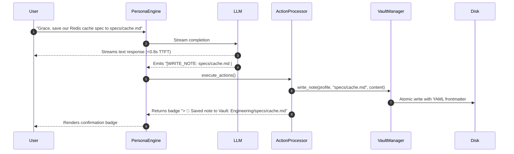

# 🛡️ Sandboxed Obsidian Vault & Autonomous File Protocols

Sympose connects AI agents directly to your local **Obsidian Vault** for persistent note-taking, daily journaling, and session archival. To prevent cloud LLMs or rogue agent prompts from reading or corrupting private personal notes, Sympose enforces a strict **Domain Sandboxing Security Architecture** combined with **Autonomous Action Tag Protocols**.

---

## 1. Multi-Folder Whitelist & Domain Sandboxing (ADR-011)

Sympose supports existing Obsidian vault structures without requiring file reorganizations. Agent manifests configure their domain boundaries using `vault_folders`:

| Mode | Manifest Syntax | Description |
| :--- | :--- | :--- |
| **Multi-Folder Whitelist** | `vault_folders: ["Projects", "Architecture", "Reference"]` | Agent searches & reads across all listed folders. |
| **Full Vault Access** | `vault_folders: ["*"]` or `vault_folder: ""` | Agent has root access to read/search across the entire vault. |
| **Single Folder (Legacy)** | `vault_folder: "Projects"` | Agent is isolated to a single domain subfolder. |

### Active Profile Permissions

| Agent | Model Tier | Permitted Folders | Security Boundary |
| :--- | :--- | :--- | :--- |
| **@grace** | Cloud (Gemini/Claude) | `Projects/`, `Architecture/`, `Reference/`, `Daily Notes/` | Blocked from `Personal/`, `Finances/` |
| **@samantha** | Cloud (Gemini) | `General/`, `Projects/`, `Strategy/`, `Daily Notes/` | Blocked from `Personal/`, `Finances/`, `Architecture/` |
| **@aurelius** | **Local Offline (Ollama)** | `Journal/`, `Personal/`, `Daily Notes/` | 100% Air-Gapped local journaling |

> [!NOTE]
> **The Deny-by-Default Security Model:**  
> In Sympose, permissions are closed by default. An agent has zero visibility into any directory unless that folder is explicitly declared in its `vault_folders` list. To restrict an agent (e.g., Samantha) from specific directories (like `Personal/` or `Finances/`), simply leave them off that agent's manifest. No complex ACLs or permission daemons needed.

---

## 2. Defensive Path Validation (`is_safe_path`)

To prevent Path Traversal attacks (e.g. `../../etc/passwd` or accessing another agent's private vault domain), every file read and write operation is verified through [`sympose/config.py:is_safe_path()`](file:///Users/damiro/Development/sympose/sympose/config.py):

```python
def is_safe_path(target_path: str, base_dir: str) -> bool:
    """Ensures target_path resolves strictly within base_dir (prevents ../ traversal)."""
    try:
        base = os.path.realpath(base_dir)
        target = os.path.realpath(target_path)
        return os.path.commonpath([base]) == os.path.commonpath([base, target])
    except Exception:
        return False
```

If an agent or command attempts to escape its assigned domain folder:
1. The file write/read is aborted immediately.
2. A `Security Error` is returned.
3. No external files or sensitive personal directories are exposed to cloud models.

---

## 3. Autonomous Action Tag Protocol (ADR-009)

Agents can autonomously create, append, and log notes during conversations without roundtrip latency penalties by emitting structured action tags inline:



### Action Tag Specifications

| Action Tag | Syntax | Behavior |
| :--- | :--- | :--- |
| **Write Note** | `[WRITE_NOTE: <file.md> \| <content>]` | Creates or overwrites a sandboxed Markdown file with clean Obsidian YAML frontmatter. |
| **Append Note** | `[APPEND_NOTE: <file.md> \| <content>]` | Appends a section to an existing sandboxed note. |
| **Daily Log** | `[DAILY_NOTE: <reflection>]` | Appends a timestamped reflection to `Daily Notes/YYYY-MM-DD.md`. |
| **Working Memory**| `[REMEMBER: <fact>]` | Appends bullet points to `profiles/{handle}_memory.md`. |

---

## 4. Pre-Turn Grounded Vault Retrieval

When a user asks an agent to inspect a past note (e.g. *"Grace, check what we wrote in `specs/cache.md`"* or *"Search vault for OAuth"*), [`PersonaEngine._resolve_vault_context()`](file:///Users/damiro/Development/sympose/sympose/engine.py) performs a `<3ms` local read/search across the agent's sandboxed domain and injects the excerpt into the turn's prompt before streaming.

This delivers instant, grounded contextual awareness without additional network roundtrips.

---

## 5. Pluggable Search Tiers (ADR-003)

[`VaultManager.search()`](file:///Users/damiro/Development/sympose/sympose/vault.py) supports modular search backends configured in `config.yaml`:

- **Tier 1: `direct` (Default / Pure Python)**: Zero dependencies, ultra-fast regex/substring scan over domain notes.
- **Tier 2: `sqlite_fts`**: Ranked BM25 full-text search indexed in SQLite.
- **Tier 3: `semantic`**: Local vector embeddings via SentenceTransformers.
