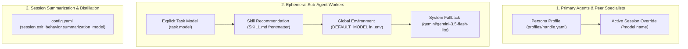

# ⚙️ Configuration & Live Tuning

Sympose separates system performance and exit policies from agent manifests using a centralized [`config.yaml`](../../../config.yaml) file.

---

## 1. Master `config.yaml` Structure

```yaml
performance:
  request_timeout: 10.0          # Hard timeout in seconds per completion
  max_context_turns: 15          # Sliding window history slice (15 user + 15 assistant)
  drop_unsupported_params: true  # Prevents provider schema mismatch crashes
  stream: true                   # Enable real-time 60 FPS token streaming

session:
  exit_behavior:
    auto_save: false             # If true, auto-saves without modal prompt on /exit
    default_target: "both"       # Options: "memory", "obsidian", "both"
    clear_terminal: true         # Clears screen on exit for clean terminal reset
    obsidian_subfolder: "Sessions" # Subfolder in persona domain folder
    summarization_model: "gemini/gemini-3.5-flash-lite" # Fast distillation model

memory:
  user_profile_file: "profiles/user_profile.md"    # Universal user identity
  shared_memory_file: "profiles/_shared_memory.md"  # Collaborative team pool
  compaction_threshold: 25                         # Trigger background compaction at 25 lines
  auto_compact: true                               # Enable background deduplication pass

runtime:
  default_persona: "samantha"
  profiles_dir: "profiles"

vault:
  daily_notes_folder: "Daily Notes"
  search_mode: "direct"          # Options: "direct" (Pure Python), "sqlite_fts", "semantic"
```

---

## 2. In-Session Live CLI Tuning

You can inspect and update configuration parameters dynamically without restarting the application:

```bash
# View active configuration
/config

# Change sliding context window size
/config set performance.max_context_turns 20

# Change default request timeout
/config set performance.request_timeout 8.0

# Enable auto-save on exit
/config set session.exit_behavior.auto_save true
```

---

## 3. Multi-Model Routing & Provider Configuration

Sympose natively supports multi-provider model routing powered by `litellm`. You can mix and match cloud APIs, unified aggregators like **OpenRouter**, and local backends like **Ollama**.

### Supported Provider Prefixes & Environment Variables

| Provider / Router | Model Prefix Format | Required `.env` Variable | Example Model ID |
| :--- | :--- | :--- | :--- |
| **OpenRouter** | `openrouter/<provider>/<model>` | `OPENROUTER_API_KEY` | `openrouter/anthropic/claude-3.7-sonnet`, `openrouter/deepseek/deepseek-r1` |
| **Google Gemini** | `gemini/<model>` | `GEMINI_API_KEY` | `gemini/gemini-3.5-flash-lite`, `gemini/gemini-2.5-pro` |
| **Anthropic Claude** | `anthropic/<model>` | `ANTHROPIC_API_KEY` | `anthropic/claude-3-5-sonnet-20241022` |
| **OpenAI** | `openai/<model>` | `OPENAI_API_KEY` | `openai/gpt-4o`, `openai/o3-mini` |
| **Local Ollama** | `ollama/<model>` | *(None / `ollama serve`)* | `ollama/qwen2.5:7b`, `ollama/deepseek-r1:14b` |

### 3-Tier Model Resolution Hierarchy

Model selection in Sympose is resolved across three layers:



1. **Primary Agents (`@grace`, `@samantha`, `@aurelius`)**:
   - Specified via the `model:` attribute in [`profiles/<handle>.yaml`](../../../profiles/grace.yaml).
   - Can be temporarily swapped live in the terminal using `/model <model_name>`.
2. **Ephemeral Sub-Agent Workers (`/worker` or `[SPAWN_WORKER]`)**:
   - **Step 1:** Explicit `model` parameter if dispatched programmatically in code.
   - **Step 2:** `recommended_models` list declared in [`skills/<skill>/SKILL.md`](../../../skills/code_review/SKILL.md) frontmatter.
   - **Step 3:** `DEFAULT_MODEL` declared in `.env`.
   - **Step 4:** System fallback (`gemini/gemini-3.5-flash-lite`).
3. **Session Archivist & Distillation**:
   - Specified via `session.exit_behavior.summarization_model` in [`config.yaml`](../../../config.yaml).

### In-Session `/model` CLI Tooling & Dynamic Discovery

```bash
# 1. View active model, provider API key health & recommended catalog
/model

# 2. Search OpenRouter's live catalog directly inside the CLI
/model find sonnet
/model find deepseek
/model find flash

# 3. Refresh local catalog cache from OpenRouter API
/model refresh

# 4. Temporarily switch active persona's model
/model openrouter/anthropic/claude-sonnet-4.5

# 5. Reset model back to profile default (e.g. from profiles/grace.yaml)
/model reset
```

