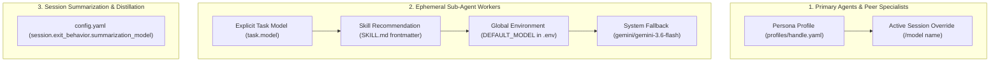

# ⚙️ Configuration & Live Tuning

Sympose separates system performance and exit policies from agent manifests using a centralized [`config.yaml`](../../../config.yaml) file. Every knob is declared once in the schema module `sympose/config_schema.py` ([ADR-077](../../journal/2026-09/2026-09-08_adr-077-declarative-configuration-schema.md)); `config.yaml` only carries the values you override.

---

## 1. The knob reference

The authoritative list of every setting — key, type, default, allowed values, live-vs-restart, and a one-line description — is the generated **[Configuration Reference](../reference/configuration.md)**. It is rendered from the schema (`python -m sympose.config_reference`) and a test fails if it drifts, so it never goes stale. A fresh workspace's `config.yaml` is seeded from the same schema.

Settings are grouped into sections: **Performance & Streaming**, **Session & Memory**, **Runtime**, **Vault**, **Worker Sandbox**, and **Persona** (the last set live in `profiles/<handle>.yaml`, not `config.yaml`). A representative slice:

```yaml
performance:
  request_timeout: 30.0          # cloud-model HTTP timeout, seconds
  local_request_timeout: 120.0   # local (ollama/…) model timeout, seconds
  max_context_turns: 15          # conversation turns kept in the context window
  stream: true                   # stream model output token-by-token
  render_mode: hybrid            # raw | hybrid | buffered

session:
  exit_behavior:
    auto_save: false
    default_target: memory       # memory | vault | both
    summarization_model: ""      # empty = use the active chat model

vault:
  search_mode: direct            # direct | sqlite_fts | semantic
  grounding_default: auto        # auto | strict | trust
```

Unknown keys in `config.yaml` are ignored, so hand-adding one does nothing until code reads it.

---

## 2. Live tuning — `/config`

Inspect and change **global** settings in-session, no restart (unless the reference marks the key *restart*):

```bash
/config                                        # list every setting, grouped, with live values
/config get performance.render_mode            # one key: value, default, type, allowed values
/config set performance.max_context_turns 20   # coerced + validated, then persisted to config.yaml
/config set session.exit_behavior.auto_save true
```

`/config set` rejects a bad enum, an out-of-range number, an unknown key, or a persona-scoped key (pointing you at `/persona set`) *before* it writes anything. The model can do the same via the `[CONFIG_SET: <key> | <value>]` action tag.

---

## 3. Per-persona knobs — `/persona`

A handful of settings are **persona-scoped** — `vault_grounding`, `keep_alive`, `share_memory`, `temperature`, `model`, `api_base` — and live in each persona's manifest rather than `config.yaml`:

```bash
/persona show @samantha                       # list this persona's knobs and current values
/persona set @samantha temperature 0.6        # coerced + validated, written to profiles/samantha.yaml
/persona set @samantha vault_grounding strict
```

`/persona set` runs the same coercion and validation as `/config set`; a global key is refused with a pointer back to `/config`. The write updates only the one key in the manifest — hand-written comments in the file are not preserved.

---

## 4. Multi-Model Routing & Provider Configuration

Sympose natively supports multi-provider model routing powered by `litellm`. You can mix and match cloud APIs, unified aggregators like **OpenRouter**, and local backends like **Ollama**.

### Supported Provider Prefixes & Environment Variables

| Provider / Router | Model Prefix Format | Required `.env` Variable | Example Model ID |
| :--- | :--- | :--- | :--- |
| **OpenRouter** | `openrouter/<provider>/<model>` | `OPENROUTER_API_KEY` | `openrouter/anthropic/claude-3.7-sonnet`, `openrouter/deepseek/deepseek-r1` |
| **Google Gemini** | `gemini/<model>` | `GEMINI_API_KEY` | `gemini/gemini-3.6-flash`, `gemini/gemini-2.5-pro` |
| **Anthropic Claude** | `anthropic/<model>` | `ANTHROPIC_API_KEY` | `anthropic/claude-3-5-sonnet-20241022` |
| **OpenAI** | `openai/<model>` | `OPENAI_API_KEY` | `openai/gpt-4o`, `openai/o3-mini` |
| **Local Ollama** | `ollama/<model>` | *(None / `ollama serve`)* | `ollama/qwen2.5:7b`, `ollama/deepseek-r1:14b` |

### 3-Tier Model Resolution Hierarchy

Model selection in Sympose is resolved across three layers:



1. **Primary Agents (`@grace`, `@samantha`, `@aurelius`)**:
   - Specified via the `model:` attribute in [`profiles/<handle>.yaml`](../../../profiles/grace.yaml).
   - Can be temporarily swapped live in the terminal using `/model <model_name>`.
2. **Ephemeral Sub-Agent Workers (`/worker` or `[SPAWN_WORKER]`)**:
   - **Step 1:** Explicit `model` parameter if dispatched programmatically in code.
   - **Step 2:** `recommended_models` list declared in [`sympose/builtin_skills/<skill>/SKILL.md`](../../../sympose/builtin_skills/code_review/SKILL.md) frontmatter.
   - **Step 3:** `DEFAULT_MODEL` declared in `.env`.
   - **Step 4:** System fallback (`gemini/gemini-3.6-flash`).
3. **Session Archivist & Distillation**:
   - Specified via `session.exit_behavior.summarization_model` in [`config.yaml`](../../../config.yaml).

### In-Session `/model` CLI Tooling & Dynamic Discovery

```bash
# 1. View active model, provider API key health & recommended catalog
/model

# 2. Search OpenRouter's live catalog directly inside the CLI
/model find sonnet
/model find deepseek
/model find flash

# 3. Refresh local catalog cache from OpenRouter API
/model refresh

# 4. Temporarily switch active persona's model
/model openrouter/anthropic/claude-sonnet-4.5

# 5. Reset model back to profile default (e.g. from profiles/grace.yaml)
/model reset
```

