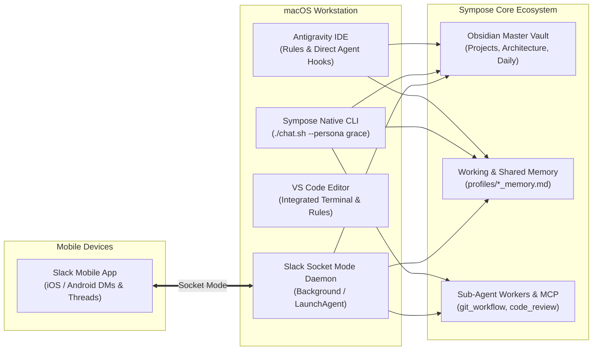

# 🛠️ Developer Workflows & Daemon Persistence Guide

> **A practical guide for pair-programming with Grace Hopper across Antigravity IDE, VS Code, and mobile devices via the persistent Slack daemon.**

---

## 🧭 Environment Interaction Matrix

Sympose and the Grace Hopper persona can be operated across three primary execution environments:



| Dimension | Antigravity IDE Agent | Sympose Native CLI | VS Code (Terminal + Rules) | Slack Mobile Companion |
| :--- | :--- | :--- | :--- | :--- |
| **Launch Command** | Native chat panel | `./chat.sh --persona grace` | `./chat.sh` in VS Code terminal | Open Slack App on phone |
| **Primary Role** | Direct file editing, live diffs | Terminal REPL, deep reasoning | Code writing & side-by-side CLI | Remote check-in & spec query |
| **Tool Execution** | Native IDE file / shell tools | WorkerEngine subprocess tools | Subprocess tools via CLI | Subprocess & MCP tools via Mac |
| **Memory Sync** | Read workspace context | Live read/write `grace_memory.md` | Live read/write `grace_memory.md` | Live read/write `grace_memory.md` |
| **Vault Access** | Local files | Native `VaultManager` | Native `VaultManager` | Native `VaultManager` |
| **Mobility** | Desktop only | Desktop only | Desktop only | **Anywhere (iOS / Android)** |

---

## 💻 1. Developing with Grace Locally

### Option A: Antigravity IDE Agent Mode
In Antigravity, Grace’s persona is loaded automatically through [`.agents/rules/identity.md`](../../../.agents/rules/identity.md).
* **Best for**: Direct autonomous code edits, complex multi-file refactors, and live IDE test runs.
* **Usage**: Chat directly in the Antigravity side panel. Grace adheres to the `<200 LOC per file` standard and zero-bloat principles.

### Option B: Side-by-Side Integrated Terminal (VS Code / Antigravity)
Run Sympose's native interactive CLI directly inside your editor’s integrated terminal (`⌃ + ~` / `Cmd + ~`):

```bash
# Boot directly into Grace's persona
./chat.sh --persona grace
```

* **Best for**: Low-latency interactive architectural discussions, reviewing git diffs, and searching Obsidian notes while you write code.
* **Key Advantage**: Terminal stack traces and file paths (e.g. `sympose/slack.py:42`) can be `Cmd + Clicked` to instantly jump to that line in your editor.

---

## 📱 2. Mobile Access via Slack Socket Mode

Sympose includes a multi-agent Slack daemon utilizing **Socket Mode**. Because connections are outbound WebSockets, **zero inbound firewall ports, public URLs, or ngrok tunnels are required**.

```
[Phone (Slack Mobile)] ───> [Slack Cloud] ───> [Mac Daemon (sympose.slack)] ───> [LLM + Vault]
```

### Setup & Credentials
Ensure your [`.env`](../../../.env) contains the Slack tokens:
```bash
SLACK_GRACE_BOT_TOKEN=xoxb-...
SLACK_GRACE_APP_TOKEN=xapp-1-...
```

### Mobile Capabilities
* **Direct Messages**: Open a DM with **Grace Hopper** to brainstorm architectures, ask for code snippets, or query your Obsidian vault notes.
* **Channel Collaboration**: Mention `@Grace Hopper` in channels to get instant code reviews or git commit message plans.
* **Real-time Memory Sync**: Any fact Grace learns in Slack via `[REMEMBER]` is saved to `profiles/grace_memory.md` and immediately accessible to your local terminal sessions.

---

## 🔄 3. Daemon Persistence: Keeping Slack Running 24/7

To ensure you can chat with Grace on mobile even when you close your IDE or terminal, use one of the persistence methods below on your Mac.

### Method 1: `tmux` (Interactive & Inspectable — Recommended)

`tmux` keeps the process alive in a detached session you can re-attach to at any time.

```bash
# 1. Create a new tmux session
tmux new -s sympose-slack

# 2. Launch the Slack daemon
./chat.sh --slack

# 3. Detach from the session
# Press Ctrl + B, release, then press D
```

* **Inspect live logs later**:
  ```bash
  tmux attach -t sympose-slack
  ```
* **Stop the daemon**:
  ```bash
  tmux kill-session -t sympose-slack
  ```

---

### Method 2: `nohup` (Zero-Dependency Background Job)

Runs the daemon in the background and redirects all logs to a disk file.

```bash
# Start in background
nohup ./chat.sh --slack > sympose_slack.log 2>&1 &

# Follow live output
tail -f sympose_slack.log

# Stop the daemon
pkill -f "app.py --slack"
```

---

### Method 3: `pm2` (Process Monitor with Auto-Restart)

If Node.js is installed, `pm2` automatically restarts the daemon if it crashes or the network drops.

```bash
# Start with PM2
npx pm2 start ./chat.sh --name "sympose-slack" -- --slack

# View status & logs
npx pm2 status
npx pm2 logs sympose-slack

# Stop
npx pm2 stop sympose-slack
```

---

### Method 4: macOS `launchd` (Auto-Start on Mac Boot / Login)

For a permanent "always-on" daemon that starts automatically when your Mac boots:

1. Create `~/Library/LaunchAgents/com.sympose.slack.plist`:

```xml
<?xml version="1.0" encoding="UTF-8"?>
<!DOCTYPE plist PUBLIC "-//Apple//DTD PLIST 1.0//EN" "http://www.apple.com/DTDs/PropertyList-1.0.dtd">
<plist version="1.0">
<dict>
    <key>Label</key>
    <string>com.sympose.slack</string>
    <key>ProgramArguments</key>
    <array>
        <string>/bin/bash</string>
        <string>-c</string>
        <string>cd /Users/damiro/Development/sympose &amp;&amp; ./chat.sh --slack</string>
    </array>
    <key>RunAtLoad</key>
    <true/>
    <key>KeepAlive</key>
    <true/>
    <key>StandardOutPath</key>
    <string>/Users/damiro/Development/sympose/slack_daemon.log</string>
    <key>StandardErrorPath</key>
    <string>/Users/damiro/Development/sympose/slack_daemon.err</string>
</dict>
</plist>
```

2. **Load the agent**:
   ```bash
   launchctl load ~/Library/LaunchAgents/com.sympose.slack.plist
   ```

3. **Unload / Stop**:
   ```bash
   launchctl unload ~/Library/LaunchAgents/com.sympose.slack.plist
   ```

---

## ⚡ Quick Reference Card

```text
┌─────────────────────────────────────────────────────────────────────────────┐
│                            SYMPOSE CHEAT SHEET                              │
├───────────────────────────────────┬─────────────────────────────────────────┤
│ Active Local Coding (Grace)       │ ./chat.sh --persona grace               │
│ Launch Slack Daemon (Foreground)  │ ./chat.sh --slack                       │
│ Launch Slack Daemon (tmux)        │ tmux new -s sympose-slack './chat.sh    │
│                                   │ --slack'                                │
│ Inspect Slack Daemon Logs (tmux)  │ tmux attach -t sympose-slack            │
│ Switch Persona inside CLI         │ /switch @grace | /switch @samantha      │
│ Query Vault Notes inside CLI      │ /vault <topic>                          │
│ List Mounted Domain Skills        │ /skills                                 │
└───────────────────────────────────┴─────────────────────────────────────────┘
```
