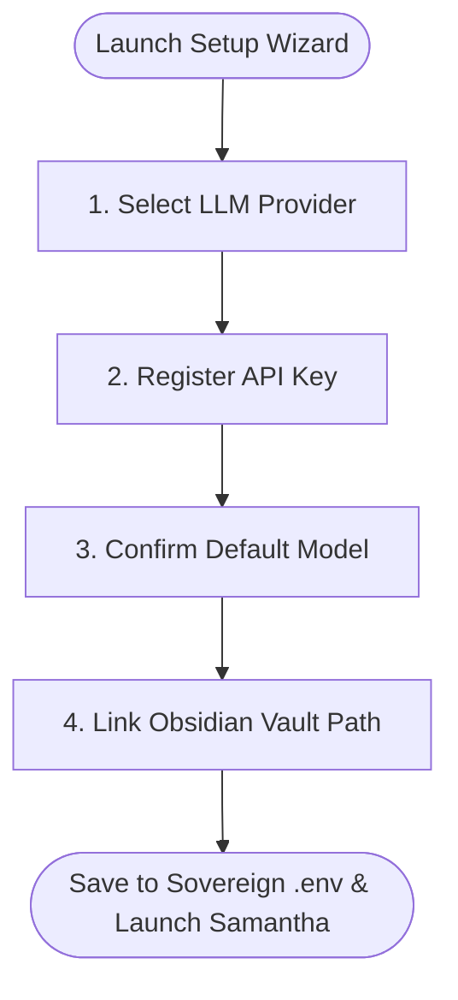

# 📦 Installation, Upgrades & Onboarding Guide

> **Sympose** is a sovereign, sub-second personal AI orchestration hub designed for **macOS Terminal**, **Linux**, **Windows**, and **Slack (Socket Mode)**.

This guide provides end-to-end instructions for installing Sympose globally, running the interactive onboarding wizard, upgrading across releases without data loss, and managing local and global workspaces.

---

## 1. System Requirements & Prerequisites

| Requirement | Specification | Purpose |
| :--- | :--- | :--- |
| **Python** | `3.11+` (3.12 recommended) | Core runtime execution |
| **pipx** | Recommended | Isolated global binary management (`pipx install ...`) |
| **Node.js** | `18+` *(Optional)* | Running external MCP servers via `npx` |
| **Ollama** | *(Optional)* | Running offline local open-weights LLMs |
| **Obsidian** | *(Optional)* | Bi-directional note-taking & daily reflection sync |

### Installing `pipx` (If not already installed)
* **macOS (Homebrew):**
  ```bash
  brew install pipx
  pipx ensurepath
  ```
* **Linux (Ubuntu/Debian):**
  ```bash
  sudo apt install pipx
  pipx ensurepath
  ```
* **Windows (Scoop / Winget):**
  ```powershell
  winget install pipx
  pipx ensurepath
  ```

---

## 2. Installation Methods

### Option A: 1-Line Standalone Global Install (Recommended)

Install Sympose in an isolated environment with its binary linked directly to your global `$PATH`:

```bash
pipx install git+https://github.com/studiodamiro/sympose.git
```

Once installed, the `sympose` CLI is immediately available in any terminal window.

---

### Option B: Local Developer Mode (Source Clone)

If you are developing custom skills, hacking on runtime core engine files, or contributing:

```bash
# 1. Clone the repository
git clone https://github.com/studiodamiro/sympose.git
cd sympose

# 2. Create and activate a clean virtual environment
python3 -m venv .venv
source .venv/bin/activate

# 3. Install in editable mode (-e)
pip install -e .
```

---

## 3. Interactive First-Run Onboarding Wizard

Sympose features an automated, zero-friction setup wizard that configures your API keys, default model, and Obsidian vault path.

```text
┌─────────────────────────────────────────────────────────────┐
│ 🧙 Sympose Interactive Setup & Onboarding Wizard            │
└─────────────────────────────────────────────────────────────┘
```

### Launching the Onboarding Wizard

You can launch the onboarding wizard in three ways:

1. **Automatic Boot:** Running `sympose` on a machine without a configured `.env` automatically starts the wizard.
2. **Explicit Flag:**
   ```bash
   sympose --setup
   # or
   sympose --onboard
   ```
3. **In-Session Slash Command:** While chatting with any agent in the CLI, type:
   ```text
   You: /setup
   # or
   You: /onboard
   ```

---

### Onboarding Steps Explained



#### Step 1: LLM Provider Selection
Select from the supported model providers:
1. **OpenRouter (Recommended)** — Multi-provider gateway (Claude, Gemini, DeepSeek, Llama, Qwen).
2. **Google Gemini API** — High-speed direct API (`gemini/gemini-3.6-flash`).
3. **Anthropic Claude API** — Direct Anthropic API (`claude-3-5-sonnet-20241022`).
4. **OpenAI API** — Direct OpenAI API.
5. **Local Ollama** — Offline local models (e.g. `ollama/qwen2.5:7b`).

#### Step 2: API Key Input
Enter your provider API key. Keys are saved securely into your sovereign `.env` file (stored with strict user permissions in `~/.sympose/.env` or `./.env`).

#### Step 3: Default Model Configuration
Assign your default baseline model (e.g. `gemini/gemini-3.6-flash` or `openrouter/google/gemini-2.5-flash`). This model is used by Samantha and serves as the baseline fallback for newly generated specialist personas.

#### Step 4: Obsidian Vault Directory Linking
*(Optional)* Enter the absolute path to your Obsidian vault (e.g. `/Users/username/Documents/MyVault`). Sympose uses this path for sandboxed note reading, template rendering, and daily note journaling.

---

## 4. Upgrading Sympose

Sympose follows semantic versioning and separates application code from your user data.

### 1-Line Global Upgrade
```bash
pipx upgrade sympose
```

### Upgrading a Local Developer Clone
```bash
cd sympose
git pull origin main
pip install -e .
```

### 🛡️ Data Retention Guarantee
When you upgrade Sympose, your custom agent personas, soul directives, working memories, and configuration settings in `~/.sympose/` are **100% preserved**. Only the runtime engine code is updated.

---

## 5. Workspace Architecture (`~/.sympose/` vs. Local Repo)

Sympose uses a **Dual-Mode Workspace Resolver** (`sympose.bootstrap.resolve_workspace_dir`):

```text
┌─────────────────────────────────────────────────────────────┐
│ 1. Local Dev Workspace (CWD)                                │
│    • Activated if `./profiles/` or `./config.yaml` exists   │
│    • Perfect for contributing to Sympose in git             │
├─────────────────────────────────────────────────────────────┤
│ 2. Global Sovereign User Workspace (~/.sympose/)            │
│    • Activated when running `sympose` anywhere in system    │
│    • Persists personas, memories, logs, and .env globally   │
└─────────────────────────────────────────────────────────────┘
```

### Global User Workspace Directory Layout (`~/.sympose/`)
```text
~/.sympose/
├── .env                  # API keys and master vault path
├── config.yaml           # Runtime performance & exit knobs
├── workspace_rules.md    # Universal physical grounding rules
├── profiles/             # Your persistent agent personas
│   ├── _shared_memory.md # Collaborative team memory pool
│   ├── user_profile.md   # Universal user identity card
│   ├── samantha.yaml     # Samantha manifest
│   ├── samantha_soul.md  # Samantha soul directives
│   ├── samantha_memory.md# Samantha working memory
│   └── <custom_agent>.*  # Dynamically generated personas
└── skills/               # Reusable procedural playbooks
```

---

## 6. CLI Launch Modes

```bash
# 1. Interactive Terminal CLI (Default Hub)
sympose

# 2. Interactive Setup Wizard
sympose --setup

# 3. Web Dashboard & Standalone Vault Explorer
sympose --dashboard

# 4. 24/7 Slack Socket Mode Daemon
sympose --slack

# 5. Direct Persona Target
sympose @grace
```

---

## 7. Troubleshooting & Uninstallation

### Checking Your Active Configuration
Inside any active session, run:
```text
You: /config
You: /model
```

### Resetting Configuration
To re-run the onboarding wizard or switch providers:
```bash
sympose --setup
```

### Complete Uninstallation
To remove the Sympose global binary:
```bash
pipx uninstall sympose
```
*(Note: Your personal workspace in `~/.sympose/` is preserved. To remove it completely, run `rm -rf ~/.sympose`).*
