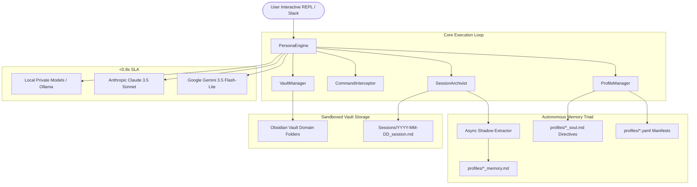

# 🏛️ Sympose Wiki
> **A zero-bloat, sub-second personal AI orchestration hub and dynamic memory system.**

Welcome to the technical documentation and engineering specifications for **Sympose**. Sympose is designed as an unbloated, developer-first alternative to heavyweight multi-agent frameworks, pairing ultra-fast cloud models (Google Gemini, Anthropic Claude) with local, private LLMs (Ollama) under a unified CLI, sandboxed Obsidian vault, and autonomous memory layer.

---

## 🗺️ System Architecture Overview

---

## 📚 Wiki Sections & Deep Dives

### 📐 [Architecture](./docs/wiki/architecture/overview.md)
* **[System Overview](./docs/wiki/architecture/overview.md):** The Triad pattern separating UI manifest, cognitive directives, and persistent memory.
* **[Sub-Second Latency Engine](./docs/wiki/architecture/sub-second-engine.md):** How Sympose achieves 0.75s TTFT on macOS by eliminating GCE metadata server hangs and managing warm connection pools.
* **[MCP & Sub-Agent Workers](./docs/wiki/architecture/mcp-and-workers.md):** Isolated, ephemeral worker sandboxes connecting to Model Context Protocol tool servers.
* **[Sandboxed Obsidian Vault](./docs/wiki/architecture/sandboxed-vault.md):** Defensive path validation, isolated domain folders, and note search tiers.
* **[Web Dashboard & Standalone Vault Explorer](./docs/wiki/architecture/dashboard-and-vault-explorer.md):** UI specification, interactive knowledge graph, multi-agent chat stream, and standalone vault explorer.

### 🧠 [Autonomous Memory System](./docs/wiki/memory/shadow-extractor.md)
* **[Selective Memory Sharing & Privacy Rings](./docs/wiki/memory/selective-sharing.md):** Air-gapping private offline agents (Aurelius) while allowing cloud agents (Samantha & Grace) to share team project memory.
* **[Heuristic Gated Shadow Extractor](./docs/wiki/memory/shadow-extractor.md):** Frictionless, zero-keyword memory capture running in detached background daemon threads.
* **[Anti-Hallucination & Grounding](./docs/wiki/memory/anti-hallucination.md):** Eliminating sycophancy with the 4 grounding pillars and honest ignorance protocols.
* **[Session Archival & Distillation](./docs/wiki/memory/session-archival.md):** Automated session logs and working memory consolidation on exit.

### 🎭 [Persona & Skills Ecosystem](./docs/wiki/agents/profile-system.md)
* **[Profile System & Dynamic Persona Genesis](./docs/wiki/agents/profile-system.md):** Seeding Samantha on fresh slate and spinning up new domain specialists on-the-fly.
* **[Modular Skills System (`SKILL.md`)](./docs/wiki/agents/skills-system.md):** Reusable procedural heuristics, domain playbooks, and tool bindings.
* **[@samantha](./docs/wiki/agents/samantha.md):** Core Starter Master Orchestrator & Concierge.
* **[Specialist Archetypes](./docs/wiki/agents/grace.md):** Example blueprints for surgical engineering (`@grace`) and offline local agents (`@aurelius`).

### 🚀 [Guides & Getting Started](./docs/wiki/guides/quickstart.md)
* **[Installation, Upgrades & Onboarding](./docs/wiki/guides/installation-and-onboarding.md):** 1-Line `pipx` install, upgrade protocols, and interactive setup wizard.
* **[Quickstart Guide](./docs/wiki/guides/quickstart.md):** Installation, API keys, and starting the interactive CLI.
* **[Developer Workflows & Daemon Persistence](./docs/wiki/guides/developer-workflows.md):** Pair-programming with Grace across Antigravity, VS Code, and background 24/7 Slack daemon.
* **[Slack Integration & Setup](./docs/wiki/guides/slack-integration.md):** 1-Click App Manifest, Socket Mode, and multi-agent Slack deployment.
* **[Configuration](./docs/wiki/guides/configuration.md):** Centralized `config.yaml` and dynamic in-session tuning.
* **[Creating Custom Agents](./docs/wiki/guides/creating-agents.md):** Defining new persona models, prompts, and vault permissions.

### 📖 [Reference](./docs/wiki/reference/cli-commands.md)
* **[CLI Commands & Shortcuts](./docs/wiki/reference/cli-commands.md):** Complete guide to `/save`, `/config`, `/switch`, `/note`, `/daily`, and `/ask`.
* **[Python API Reference](./docs/wiki/reference/python-api.md):** Package internals, class hierarchies, and integration hooks.
