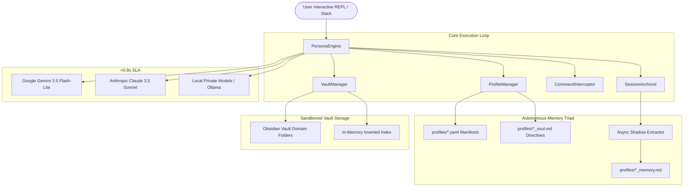

# 🏛️ Sympose Wiki
> **A zero-bloat, sub-second personal AI orchestration hub and dynamic memory system.**

Welcome to the technical documentation and engineering specifications for **Sympose**. Sympose is designed as an unbloated, developer-first alternative to heavyweight multi-agent frameworks, pairing ultra-fast cloud models (Google Gemini, Anthropic Claude) with local, private LLMs (Ollama) under a unified CLI, sandboxed Obsidian vault, and autonomous memory layer.

---

## 🗺️ System Architecture Overview

---

## 📚 Wiki Sections & Deep Dives

### 📐 [Architecture](./architecture/overview.md)
* **[System Overview](./architecture/overview.md):** The Triad pattern separating UI manifest, cognitive directives, and persistent memory.
* **[Sub-Second Latency Engine](./architecture/sub-second-engine.md):** How Sympose achieves 0.75s TTFT on macOS by eliminating GCE metadata server hangs and managing warm connection pools.
* **[MCP & Sub-Agent Workers](./architecture/mcp-and-workers.md):** Isolated, ephemeral worker sandboxes connecting to Model Context Protocol tool servers.
* **[Sandboxed Obsidian Vault](./architecture/sandboxed-vault.md):** Defensive path validation, isolated domain folders, and note search tiers.
* **[Web Dashboard & Standalone Vault Explorer](./architecture/dashboard-and-vault-explorer.md):** UI specification, interactive knowledge graph, multi-agent chat stream, and standalone vault explorer.

### 🧠 [Autonomous Memory System](./memory/shadow-extractor.md)
* **[Memory Architecture Standard](./memory/architecture-standard.md):** The definitive triad memory standard — grounding pillars, shadow extraction, and Obsidian integration.
* **[Selective Memory Sharing & Privacy Rings](./memory/selective-sharing.md):** Air-gapping private offline agents (Aurelius) while allowing cloud agents (Samantha & Grace) to share team project memory.
* **[Heuristic Gated Shadow Extractor](./memory/shadow-extractor.md):** Frictionless, zero-keyword memory capture running in detached background daemon threads.
* **[Anti-Hallucination & Grounding](./memory/anti-hallucination.md):** Eliminating sycophancy with the 4 grounding pillars and honest ignorance protocols.
* **[Session Archival & Distillation](./memory/session-archival.md):** Working memory consolidation on exit and sovereign `.jsonl` conversation history.

### 🎭 [Persona & Skills Ecosystem](./agents/profile-system.md)
* **[Profile System & Dynamic Persona Genesis](./agents/profile-system.md):** Seeding Samantha on fresh slate and spinning up new domain specialists on-the-fly.
* **[Modular Skills System (`SKILL.md`)](./agents/skills-system.md):** Reusable procedural heuristics, domain playbooks, and tool bindings.
* **[@samantha](./agents/samantha.md):** Core Starter Master Orchestrator & Concierge.
* **[Specialist Archetypes](./agents/grace.md):** Example blueprints for surgical engineering (`@grace`) and offline local agents (`@aurelius`).

### 🚀 [Guides & Getting Started](./guides/quickstart.md)
* **[Installation, Upgrades & Onboarding](./guides/installation-and-onboarding.md):** 1-Line `pipx` install, upgrade protocols, and interactive setup wizard.
* **[Quickstart Guide](./guides/quickstart.md):** Installation, API keys, and starting the interactive CLI.
* **[Developer Workflows & Daemon Persistence](./guides/developer-workflows.md):** Pair-programming with Grace across Antigravity, VS Code, and background 24/7 Slack daemon.
* **[Slack Integration & Setup](./guides/slack-integration.md):** 1-Click App Manifest, Socket Mode, and multi-agent Slack deployment.
* **[Slack Socket Mode Setup Guide](./guides/slack-setup.md):** The full step-by-step app-manifest walkthrough.
* **[Configuration](./guides/configuration.md):** Centralized `config.yaml` and dynamic in-session tuning.
* **[Latency & Performance Tuning Guide](./guides/latency-tuning.md):** The catalog of knobs, timeouts, context windows, and model configuration governing the sub-second SLA.
* **[Creating Custom Agents](./guides/creating-agents.md):** Defining new persona models, prompts, and vault permissions.

### 📖 [Reference](./reference/cli-commands.md)
* **[CLI Commands & Shortcuts](./reference/cli-commands.md):** Complete guide to `/save`, `/config`, `/switch`, `/note`, `/daily`, and `/ask`.
* **[Python API Reference](./reference/python-api.md):** Package internals, class hierarchies, and integration hooks.
* **[Web Dashboard UI Design Reference](./reference/ui-design-reference.md):** The flat "Sovereign Craft" design brief — theme presets, semantic tokens, layout shell, per-screen artboards.

---

## 🗂️ Engineering Journal & ADR Index

Chronological milestones and Architectural Decision Records live under
`docs/journal/YYYY-MM/`. The master index is
[`docs/PROJECT_JOURNAL.md`](../PROJECT_JOURNAL.md); this table mirrors its ADR
list and is kept in sync per the
[documentation standard](../../.agents/rules/documentation_standards.md) (B.4).

| ADR | Title | Status | Date |
| --- | ----- | ------ | ---- |
| [ADR-065](../journal/2026-08/2026-08-30_adr-065-mcp-client-threading-logging-standard.md) | MCP Client Threading & Logging Standard | Accepted | 2026-08-30 |
| [ADR-064](../journal/2026-08/2026-08-30_adr-064-dashboard-api-auth-plan.md) | Dashboard/API Gateway Security Design Gap & Zero-Dependency Auth Plan | Proposed | 2026-08-30 |
| [ADR-069](../journal/2026-08/2026-08-29_adr-069-live-stream-markdown-parsing.md) | Live Stream Markdown Parsing for Real-Time Badges & Sub-Agent Reports | Accepted | 2026-08-29 |
| [ADR-068](../journal/2026-08/2026-08-29_adr-068-subagent-worker-report-panel-styling.md) | Sub-Agent Worker Report Panel Styling & Redundant Synthesis Gating | Accepted | 2026-08-29 |
| [ADR-067](../journal/2026-08/2026-08-29_adr-067-ghost-session-pruning.md) | Intelligent Ghost Session Pruning & Substantive Conversation Gating | Accepted | 2026-08-29 |
| [ADR-066](../journal/2026-08/2026-08-29_adr-066-terminal-markdown-presentation-standard.md) | Terminal Markdown Presentation Standard (vault_recall) & Beautified Sub-Agent Orchestration | Accepted | 2026-08-29 |
| [ADR-063](../journal/2026-08/2026-08-29_adr-063-system-wide-llm-timeout-hardening.md) | System-Wide LLM Timeout Hardening | Accepted | 2026-08-29 |
| [ADR-062](../journal/2026-08/2026-08-29_adr-062-render-mode-raw-panel-suppression.md) | render_mode: raw Panel Suppression in the Action Executor | Accepted | 2026-08-29 |
| [ADR-061](../journal/2026-08/2026-08-29_adr-061-subagent-read-note-explicit-intent-gating.md) | Sub-Agent [READ_NOTE] Explicit-Intent Gating | Accepted | 2026-08-29 |
| [ADR-060](../journal/2026-08/2026-08-29_adr-060-terminal-render-mode-knob.md) | Three-Way Terminal Render Mode Knob (performance.render_mode) | Accepted | 2026-08-29 |
| [ADR-059](../journal/2026-08/2026-08-29_adr-059-clean-range-prompts-signal-interruption.md) | Repository-Wide Clean Range Prompts & Graceful Asynchronous Signal Interruption (SIGINT) | Accepted | 2026-08-29 |
| [ADR-058](../journal/2026-08/2026-08-29_adr-058-multisectionpanel-in-terminal-note-viewer.md) | MultiSectionPanel In-Terminal Note Viewer with Inline T-Junction Box Dividers | Accepted | 2026-08-29 |
| [ADR-057](../journal/2026-08/2026-08-29_adr-057-structured-vault-retrieval-context-excerpts.md) | Orderly Structured Vault Retrieval & Single-Line Context Excerpts | Accepted | 2026-08-29 |
| [ADR-056](../journal/2026-08/2026-08-29_adr-056-retire-automated-vault-session-dumping.md) | Retirement of Automated Vault Session Dumping in Favor of Native History Sovereignty | Accepted | 2026-08-29 |
| [ADR-055](../journal/2026-08/2026-08-29_adr-055-milestone-based-async-titling.md) | Milestone-Based Asynchronous Titling & Generic Prompt Filtering | Accepted | 2026-08-29 |
| [ADR-054](../journal/2026-08/2026-08-29_adr-054-jsonl-conversation-persistence-context-hydration.md) | Zero-Bloat Conversation Persistence (.jsonl), Decoupled UI History & Sliding Context Window Hydration | Accepted | 2026-08-29 |
| [ADR-053](../journal/2026-08/2026-08-29_adr-053-cross-platform-native-desktop-launchers.md) | Cross-Platform Native Desktop Launchers & Zero-Bloat Frameless App-Mode Wrappers | Accepted | 2026-08-29 |
| [ADR-052](../journal/2026-08/2026-08-29_adr-052-in-memory-metadata-caching-scalability.md) | In-Memory Metadata Caching & Sub-5ms Scalability Standard | Accepted | 2026-08-29 |
| [ADR-051](../journal/2026-08/2026-08-29_adr-051-flat-web-dashboard-knowledge-nebula-theme-engine.md) | Flat Architectural Web Dashboard, 2D/3D Knowledge Nebula & shadcn Theme Customizer Engine | Accepted | 2026-08-29 |
| [ADR-050](../journal/2026-08/2026-08-29_adr-050-interactive-skill-command-suite.md) | Interactive Skill Command Suite (/skill & /skills) with Tab Auto-Completion | Accepted | 2026-08-29 |
| [ADR-049](../journal/2026-08/2026-08-29_adr-049-code-fence-action-tag-parsing.md) | Robust Code-Fence Action Tag Parsing & Dynamic Cache Resolution | Accepted | 2026-08-29 |
| [ADR-048](../journal/2026-08/2026-08-29_adr-048-dynamic-3-tier-model-hierarchy.md) | Dynamic 3-Tier Model Hierarchy & Runtime Fallback Architecture | Accepted | 2026-08-29 |
| [ADR-047](../journal/2026-08/2026-08-29_adr-047-cli-design-system-typography.md) | Standardized Sympose CLI Design System (SYMPOSE_THEME) & Typography Standard | Accepted | 2026-08-29 |
| [ADR-046](../journal/2026-08/2026-08-29_adr-046-samantha-only-clean-slate-persona-genesis.md) | Samantha-Only Clean Slate & Dynamic Autonomic Persona Genesis | Accepted | 2026-08-29 |
| [ADR-045](../journal/2026-08/2026-08-29_adr-045-standalone-packaging-sovereign-workspace.md) | Modern Standalone Python Packaging (pyproject.toml) & Sovereign User Workspace | Accepted | 2026-08-29 |
| [ADR-044](../journal/2026-08/2026-08-27_adr-044-in-memory-inverted-index-backlink-engine.md) | In-Memory Inverted Index & Deterministic Backlink Lookup Engine | Accepted | 2026-08-27 |
| [ADR-043](../journal/2026-08/2026-08-27_adr-043-three-layer-separation-soul-skill-physics.md) | Three-Layer Architectural Separation (Soul vs Skill vs System Physics) | Accepted | 2026-08-27 |
| [ADR-042](../journal/2026-08/2026-08-27_adr-042-autonomous-live-internet-search.md) | Autonomous Live Internet Search (web_search) & Zero-Key ddgs Standard | Accepted | 2026-08-27 |
| [ADR-041](../journal/2026-08/2026-08-27_adr-041-slack-thread-active-context-isolation.md) | Multi-Turn Slack Thread Active Context Isolation & Single-Source Action Execution | Accepted | 2026-08-27 |
| [ADR-040](../journal/2026-08/2026-08-27_adr-040-native-obsidian-templates-frontmatter-sync.md) | Native Obsidian Templates/ Engine & Dynamic Frontmatter Tag Syncing | Accepted | 2026-08-27 |
| [ADR-039](../journal/2026-08/2026-08-27_adr-039-vault-write-skill-wikilink-taxonomy.md) | Modular vault_write Skill, Obsidian Wikilink Taxonomy & Nested Hierarchies | Accepted | 2026-08-27 |
| [ADR-038](../journal/2026-08/2026-08-26_adr-038-defensive-engineering-hardening-standards.md) | Post-Remediation Hardening & Defensive Engineering Standards | Accepted | 2026-08-26 |
| [ADR-037](../journal/2026-08/2026-08-26_adr-037-pure-declarative-markdown-prompting.md) | Pure Declarative Markdown-Driven Prompting & Zero-Code Injections | Accepted | 2026-08-26 |
| [ADR-036](../journal/2026-08/2026-08-26_adr-036-multi-agent-collaboration-circuit-breaker.md) | Multi-Agent Collaboration Protocol, Discussion Moderation & Safety Circuit Breaker | Accepted | 2026-08-26 |
| [ADR-035](../journal/2026-08/2026-08-26_adr-035-evidence-based-grounding-epistemic-humility.md) | Evidence-Based Grounding & Epistemic Humility Standard | Accepted | 2026-08-26 |
| [ADR-034](../journal/2026-08/2026-08-26_adr-034-autonomous-slack-reaction-autonomy.md) | Autonomous Slack Emotion & Reaction Autonomy | Accepted | 2026-08-26 |
| [ADR-033](../journal/2026-08/2026-08-26_adr-033-zero-key-native-web-search-ddgs.md) | Zero-Key Native Web Search & the ddgs Standard | Accepted | 2026-08-26 |
| [ADR-032](../journal/2026-08/2026-08-26_adr-032-first-class-mcp-directory-modular-hub.md) | First-Class mcp/ Directory Hierarchy & Modular Hub Refactor | Accepted | 2026-08-26 |
| [ADR-031](../journal/2026-08/2026-08-26_adr-031-slack-thread-deletion-command-ergonomics.md) | Slack Thread Deletion, Command Ergonomics & Memory Sovereignty | Accepted | 2026-08-26 |
| [ADR-030](../journal/2026-08/2026-08-26_adr-030-high-density-folder-digests-zero-delay.md) | High-Density Folder Digests & Universal Ban on Time-Delay Simulation | Accepted | 2026-08-26 |
| [ADR-029](../journal/2026-08/2026-08-25_adr-029-assume-interruption-write-through-state.md) | Assume Interruption Meta-Directive & Write-Through State Checkpointing | Accepted | 2026-08-25 |
| [ADR-028](../journal/2026-08/2026-08-25_adr-028-slack-socket-mode-thread-context-isolation.md) | Slack Socket Mode Integration & Thread Context Isolation | Accepted | 2026-08-25 |
| [ADR-027](../journal/2026-08/2026-08-25_adr-027-config-driven-spatial-compass.md) | Config-Driven Spatial Compass & Complete Vault Agnosticism | Accepted | 2026-08-25 |
| [ADR-026](../journal/2026-08/2026-08-25_adr-026-subagent-worker-spatial-environment-sandbox.md) | Sub-Agent Worker Spatial Environment & Inherited Sandbox Security | Accepted | 2026-08-25 |
| [ADR-025](../journal/2026-08/2026-08-25_adr-025-persistent-multi-turn-vault-context.md) | Persistent Multi-Turn Vault Context & Conversational Intent Stripping | Accepted | 2026-08-25 |
| [ADR-024](../journal/2026-08/2026-08-25_adr-024-ground-truth-sovereignty-axiom.md) | The Ground-Truth Sovereignty Axiom & Anti-Simulation Directives | Accepted | 2026-08-25 |
| [ADR-023](../journal/2026-08/2026-08-25_adr-023-centralized-vault-ignore-filters.md) | Centralized Vault Ignore Filters | Accepted | 2026-08-25 |
| [ADR-022](../journal/2026-08/2026-08-25_adr-022-local-first-hierarchical-retrieval.md) | Local-First Hierarchical Retrieval & Noise Pruning (vault_recall) | Accepted | 2026-08-25 |
| [ADR-021](../journal/2026-08/2026-08-25_adr-021-hierarchical-daily-notes-format-resolvers.md) | Hierarchical Daily Notes & Vault-Agnostic Format Resolvers | Accepted | 2026-08-25 |
| [ADR-020](../journal/2026-08/2026-08-25_adr-020-zero-maintenance-mandate.md) | The Zero-Maintenance Mandate & The Assistant Paradox | Accepted | 2026-08-25 |
| [ADR-019](../journal/2026-08/2026-08-25_adr-019-automated-memory-compaction-distillation.md) | Automated Memory Compaction & Distillation Protocol | Accepted | 2026-08-25 |
| [ADR-018](../journal/2026-08/2026-08-25_adr-018-multi-model-concierge-integration.md) | Multi-Model Concierge Integration (sympose_mastery) | Accepted | 2026-08-25 |
| [ADR-017](../journal/2026-08/2026-08-25_adr-017-openrouter-model-discovery-live-catalog.md) | Dynamic OpenRouter Model Discovery & Live Catalog Search | Accepted | 2026-08-25 |
| [ADR-016](../journal/2026-08/2026-08-25_adr-016-skill-driven-worker-model-auto-resolution.md) | Skill-Driven Sub-Agent Worker Model Auto-Resolution | Accepted | 2026-08-25 |
| [ADR-015](../journal/2026-08/2026-08-25_adr-015-multi-provider-routing-openrouter-key-injection.md) | Multi-Provider Routing & Explicit OpenRouter Key Injection | Accepted | 2026-08-25 |
| [ADR-014](../journal/2026-08/2026-08-24_adr-014-deterministic-native-tools-in-turn-synthesis.md) | Deterministic Native Tools & In-Turn Proactive Synthesis | Accepted | 2026-08-24 |
| [ADR-013](../journal/2026-08/2026-08-24_adr-013-mcp-ephemeral-subagent-worker-sandbox.md) | Model Context Protocol & Ephemeral Sub-Agent Worker Sandbox | Accepted | 2026-08-24 |
| [ADR-012](../journal/2026-08/2026-08-24_adr-012-modular-procedural-skills-system.md) | Modular Procedural Skills System (SKILL.md) | Accepted | 2026-08-24 |
| [ADR-011](../journal/2026-08/2026-08-24_adr-011-multi-folder-vault-whitelisting.md) | Multi-Folder Vault Whitelisting & Full-Vault Access Architecture | Accepted | 2026-08-24 |
| [ADR-010](../journal/2026-08/2026-08-24_adr-010-selective-memory-sharing-universal-user-profile.md) | Selective Memory Sharing & Universal User Profile Architecture | Accepted | 2026-08-24 |
| [ADR-009](../journal/2026-08/2026-08-24_adr-009-autonomous-agent-vault-access-action-protocol.md) | Autonomous Agent Vault Read/Write Access & Action Protocol | Accepted | 2026-08-24 |
| [ADR-008](../journal/2026-08/2026-08-24_adr-008-heuristic-gated-shadow-memory-extractor.md) | Heuristic-Gated Shadow Memory Extractor | Accepted | 2026-08-24 |
| [ADR-007](../journal/2026-08/2026-08-24_adr-007-memory-grounding-anti-hallucination.md) | Strict Memory Grounding, Anti-Hallucination & Honest Ignorance | Accepted | 2026-08-24 |
| [ADR-006](../journal/2026-08/2026-08-24_adr-006-autonomous-soul-memory-bootstrapping.md) | Autonomous Soul & Memory Bootstrapping | Accepted | 2026-08-24 |
| [ADR-005](../journal/2026-08/2026-08-24_adr-005-config-yaml-session-summarization-memory.md) | Centralized config.yaml, Session Summarization & Memory Consolidation | Accepted | 2026-08-24 |
| [ADR-004](../journal/2026-08/2026-08-24_adr-004-modular-package-architecture.md) | Industry-Standard Modular Package Architecture | Accepted | 2026-08-24 |
| [ADR-003](../journal/2026-08/2026-08-24_adr-003-pluggable-multi-tier-vault-search.md) | Pluggable Multi-Tier Vault Search Architecture | Accepted | 2026-08-24 |
| [ADR-002](../journal/2026-08/2026-08-24_adr-002-master-vault-domain-sandboxing.md) | Master Vault Domain Sandboxing & Access Control | Accepted | 2026-08-24 |
| [ADR-001](../journal/2026-08/2026-08-24_adr-001-core-runtime-execution-resilience.md) | Core Runtime & Execution Resilience | Accepted | 2026-08-24 |

> **ADR-060 – ADR-063 numbering.** Two sets of decisions drafted on 2026-08-29
> both claimed 060–063. The *Terminal Render Mode Knob* set keeps 060–063; the
> *Structured Vault Search* session's four extra decisions were renumbered to
> **ADR-066 – ADR-069** during the 2026-09 documentation-standard conformance
> pass. No decision content changed.
